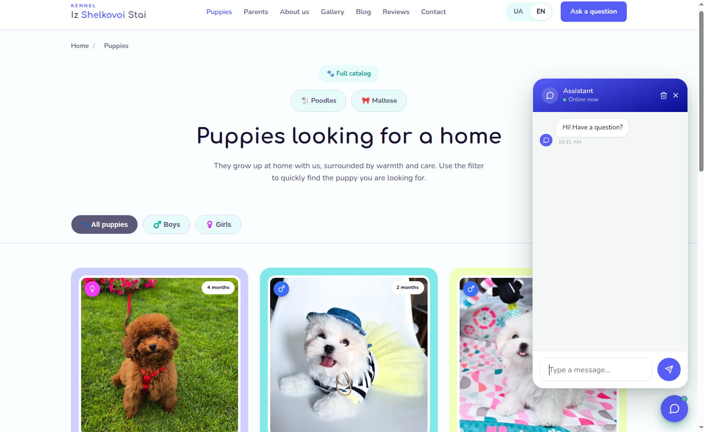

# Laravel AI Chat With Telegram Bot

[](LICENSE)
[](composer.json)
[](composer.json)
[](https://iz-shelkovoi-stai.com.ua/)

A conversational AI chat widget for Laravel applications. Drop it into any page, answer customers with an LLM that can call your own PHP code as tools (look up an order, check stock, search your content), persist full conversation history, and hand off to a human administrator over Telegram when the AI can't help.



**🔗 Live example: [iz-shelkovoi-stai.com.ua](https://iz-shelkovoi-stai.com.ua/) - try the chat widget in the bottom-right corner.**

## Features

- **Drop-in chat widget** - one Blade include, themeable, no JavaScript build step required on the host app.
- **Pluggable LLM provider** - OpenAI and Anthropic supported out of the box; implement one interface to add another.
- **Function-calling tools** - give the LLM access to your own domain logic (product search, order lookup, etc.) instead of letting it guess.
- **Persistent history** - every conversation and message is stored, scoped to a logged-in user or an anonymous visitor cookie.
- **Human handoff via Telegram** - when the AI can't answer, or the customer asks for a person, the conversation switches to a live admin chat over Telegram - no separate helpdesk needed.

## Requirements

- PHP ^8.3
- Laravel ^11.0 | ^12.0 | ^13.0

## Installation

```bash
composer require yu-laravel/laravel-ai-chat-bot
php artisan vendor:publish --tag=ai-chat-config
php artisan vendor:publish --tag=ai-chat-assets
php artisan migrate
```

Set your OpenAI key in `.env`:

```
AI_CHAT_LLM_OPEN_AI_API_KEY=sk-...
```

## Usage

Include the widget in a Blade layout:

```blade
@include('ai-chat::widget')
```

That's it - the widget renders itself, and its endpoints are namespaced under `/ai-chat` by default (configurable, see below).

## Configuration

All options live in `config/ai-chat.php` after publishing. Every option is also overridable via `.env`:

| Env variable | Default | Description |
|---|---|---|
| `AI_CHAT_ENABLED` | `true` | Turn the widget and its routes off entirely without uninstalling. |
| `AI_CHAT_LLM_DEFAULT` | `open_ai` | Which provider to use: `open_ai` or `anthropic`. |
| `AI_CHAT_WIDGET_THEME` | `default` | Widget color theme - see [Widget themes](#widget-themes). |
| `AI_CHAT_ROUTE_PREFIX` | `ai-chat` | URL prefix for the widget's routes. |
| `AI_CHAT_MAX_TOOL_ROUNDS` | `5` | Max number of tool-calling round trips per reply, as a safety cap. |
| `AI_CHAT_WELCOME_MESSAGE` | - | Optional greeting shown before the customer sends anything. |
| `AI_CHAT_SYSTEM_PROMPT` | a sensible default | Instructions given to the LLM - customize this for your domain. |
| `AI_CHAT_LLM_OPEN_AI_API_KEY` | - | Required if using the OpenAI provider. |
| `AI_CHAT_LLM_OPEN_AI_MODEL` | `gpt-4o-mini` | OpenAI model name. |
| `AI_CHAT_LLM_ANTHROPIC_API_KEY` | - | Required if using the Anthropic provider. |
| `AI_CHAT_LLM_ANTHROPIC_MODEL` | `claude-sonnet-5` | Anthropic model name. |
| `AI_CHAT_TELEGRAM_BOT_TOKEN` | - | See [Human handoff via Telegram](#human-handoff-via-telegram). |
| `AI_CHAT_TELEGRAM_ADMIN_CHAT_ID` | - | See [Human handoff via Telegram](#human-handoff-via-telegram). |
| `AI_CHAT_TELEGRAM_WEBHOOK_SECRET` | - | See [Human handoff via Telegram](#human-handoff-via-telegram). |

## LLM provider

OpenAI and Anthropic are both supported out of the box, selected via `AI_CHAT_LLM_DEFAULT` (`open_ai` or `anthropic`; `open_ai` is the default). Set the matching API key (`AI_CHAT_LLM_OPEN_AI_API_KEY` or `AI_CHAT_LLM_ANTHROPIC_API_KEY`) for whichever one you use. To add another provider, implement `Yu\AiChatBot\Contracts\LlmProviderInterface` and `Yu\AiChatBot\Contracts\LlmSettingsInterface`, then point `provider_class`/`settings_class` for that provider at your classes in `config/ai-chat.php`.

## Human handoff via Telegram

When the AI can't answer from the data it has, or the customer explicitly asks to talk to a person, it hands the conversation off to a human administrator over Telegram instead of guessing. From that point, the customer's messages are relayed to your admin chat, and the admin's replies (sent as Telegram replies to that message) show up back in the widget - no LLM involved for the rest of that conversation.

To enable it, set in `.env`:

```
AI_CHAT_TELEGRAM_BOT_TOKEN=...
AI_CHAT_TELEGRAM_ADMIN_CHAT_ID=...
AI_CHAT_TELEGRAM_WEBHOOK_SECRET=...
```

Then register the webhook with Telegram so admin replies reach your app:

```bash
curl -X POST "https://api.telegram.org/bot<BOT_TOKEN>/setWebhook" \
    -d "url=https://your-app.example/ai-chat/telegram-webhook" \
    -d "secret_token=<AI_CHAT_TELEGRAM_WEBHOOK_SECRET>"
```

**Important:** the admin must reply using Telegram's native **Reply** (swipe on the bot's message, or long-press → Reply) - not just type a new message. Telegram only includes the reply context needed to route the answer back to the right customer when you actually reply to a specific message.

## Widget themes

The widget ships with several color themes: `blue`, `purple`, `orange`, `red`, `pink`, `indigo`, `emerald`, `amber`, `slate`, `periwinkle`, plus the `default` (teal) theme built into the base CSS. Pick one with:

```
AI_CHAT_WIDGET_THEME=purple
```

Each theme is just a small CSS override of the widget's color variables (`resources/dist/themes/<name>.css`) - copy one and register your own name to make a custom color scheme.

## Adding custom tools

The chat can call your own PHP code while answering a customer (look up an order, check stock, etc.). See [`docs/creating-tools.md`](docs/creating-tools.md) for how to write and register a tool.

## Testing

```bash
composer install
vendor/bin/pest
```

## Contributing

Issues and pull requests are welcome. Please open an issue to discuss significant changes before submitting a PR.

## License

Released under the [MIT License](LICENSE).

## Author

Yuriy Akishin:
- 📧 Email: yuriy.akishin@gmail.com
- 💼 LinkedIn: https://www.linkedin.com/in/yuriyakishin/
- 💻 GitHub: https://github.com/yuriyakishin
